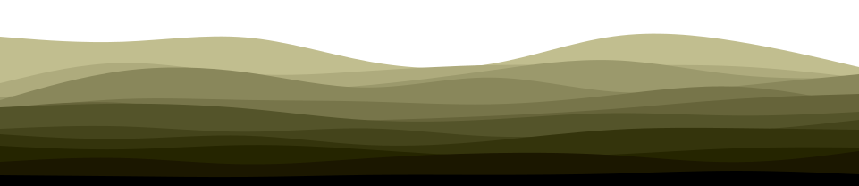

<!---  --->

<!--- - 👋 Hi, I’m Matteo (@MattScop)
- 👀 I’m interested in Coding & Programming, Piano, Sport, Books.
- 🌱 I’m currently learning HTML, CSS, JavaScript, Ruby
💞️ I’m looking to collaborate on Big Projects with mayor Companies
- 📫 How to reach me:
  email: matteo.scopece@outlook.com --->

<!---
MattScop/MattScop is a ✨ special ✨ repository because its `README.md` (this file) appears on your GitHub profile.
You can click the Preview link to take a look at your changes.
--->

<!--- ## Hey 👋, I'm Matteo Scopece!  --->

  

  

### Welcome to my profile!  
I am a T.O.P. (*the odin project*) student who is really passionate about programming. 
I want to create full stack apps that **CAN** solve <ins>problems</ins>!  
  

   

## Rapidfire  
- 🌱 <b>I’m currently learning:</b>
  
  - Unix
  - RegEx
  - HTML
  - CSS
  - JavaScript
  - Ruby 

   

## Languages and Tools  

  
  
  
  
  
  
  
  
  
  
  
  

  

   

## Github Stats  
<table><tr><td valign="top" width="50%">

</td><td valign="top" width="50%">

</td></tr></table>  

   

## Hobbies
:musical_keyboard: I play piano and compose music

<!---  
 --->
